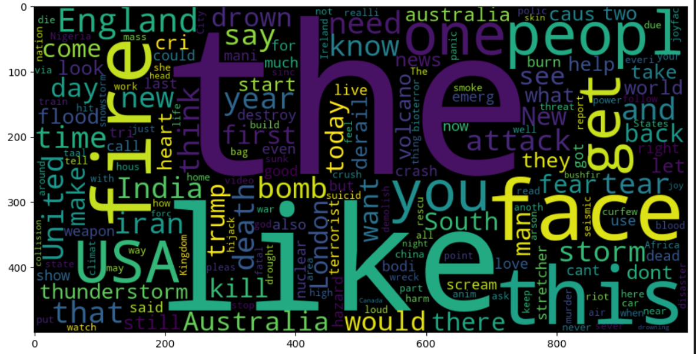
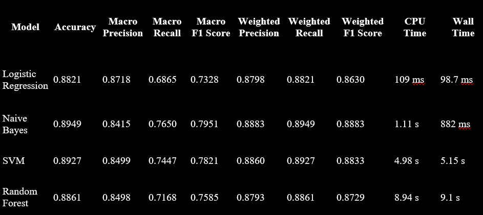

# Disaster Tweets - Sentiment Analysis

## Project Name: **NLP Disaster Tweets**

### Problem Description:
The goal of this project is to perform sentiment analysis on a dataset of Twitter disaster tweets, predicting whether a tweet refers to an **Actual Disaster** or a **Metaphorical Disaster**.

### Table of Contents:
1. **Introduction**
2. **Libraries**
3. **Loading Data**
4. **Exploratory Data Analysis**
   - Analyzing Labels
   - Analyzing Features
     - Sentence Length Analysis
5. **Data Cleaning**
   - Remove URL
   - Handle Tags
   - Handle Emoji
   - Remove HTML Tags
   - Remove Stopwords and Stemming
   - Remove Useless Characters
   - WordCloud
6. **Final Pre-Processing Data**
7. **Machine Learning**
   - Logistic Regression
   - Naive Bayes
     - Gaussian Naive Bayes
     - Bernoulli Naive Bayes
     - Complement Naive Bayes
     - Multinomial Naive Bayes
   - Support Vector Machine (SVM)
     - RBF Kernel SVM
     - Linear Kernel SVM
   - Random Forest
8. **Deep Learning**
   - Single Layer Perceptron
   - Multi-Layer Perceptron
     - Model 1: SIGMOID + ADAM
     - Model 2: SIGMOID + SGD
     - Model 3: RELU + ADAM
     - Model 4: RELU + SGD
     - Model 5: SIGMOID + BATCH NORMALIZATION + ADAM
     - Model 6: SIGMOID + BATCH NORMALIZATION + SGD
     - Model 7: RELU + DROPOUT + ADAM
     - Model 8: RELU + DROPOUT + SGD

### Pre-requisites and Installation:
This project requires **Python** and the following Python libraries:

- [NumPy](http://www.numpy.org/)
- [Pandas](http://pandas.pydata.org/)
- [Matplotlib](http://matplotlib.org/)
- [scikit-learn](http://scikit-learn.org/stable/)
- [TensorFlow](https://www.tensorflow.org/)
- [Keras](https://keras.io/)
### Data Overview:
- **Size of `tweets.csv`:** 1.53MB
- **Number of rows in `tweets.csv`:** 11,369

**Features:**
- **id:** A unique identifier for each tweet.
- **text:** The text of the tweet.
- **location:** The location the tweet was sent from (may be blank).
- **keyword:** A particular keyword from the tweet (may be blank).
- **target:** In `train.csv`, this denotes whether a tweet is about a real disaster (1) or not (0).

### WordCloud:
Word clouds are a visual representation of the frequency of words within a given set of tweets. Below is an example of a word cloud generated from the dataset.

### Results:

#### Key Performance Metrics:
- **Micro F1-Score:** Calculate metrics globally by counting the total true positives, false negatives, and false positives. This is useful for imbalanced classes.
- **Macro F1-Score:** Calculate metrics for each label and find their unweighted mean.
- **Micro-Averaged F1-Score (Mean F-Score):** The F1 score is the harmonic mean of precision and recall. An F1 score of 1 is the best, while 0 is the worst.

Models are compared based on:
- **Accuracy**
- **Precision**
- **Recall**
- **F1-Score**
- **Time**

  

### Model Performance:

- **Naive Bayes** shows the best balance of performance metrics.
- **Logistic Regression** is the fastest model.
- Models with **RELU activation** significantly outperform others, achieving F1-scores around 0.88. In contrast, **SIGMOID-based models** with or without Batch Normalization show poor performance with F1-scores near 0.05.
- **ADAM optimization** generally yields better results compared to **SGD**.
- **Dropout** slightly reduces training time but doesn't substantially improve performance.
- **RELU + ADAM** and **RELU + DROPOUT + ADAM** achieve the best balance of performance and efficiency.

### Conclusion:
- **Deep Learning models** tend to overfit and underfit easily.
- **Machine Learning techniques** like Naive Bayes and Logistic Regression should not be underestimated.
- **RELU and ADAM with Dropout** performed the best overall, as expected.

### Project Links:
- [GitHub Repository](https://github.com/PankajDevikar-Project_7_NLP)

